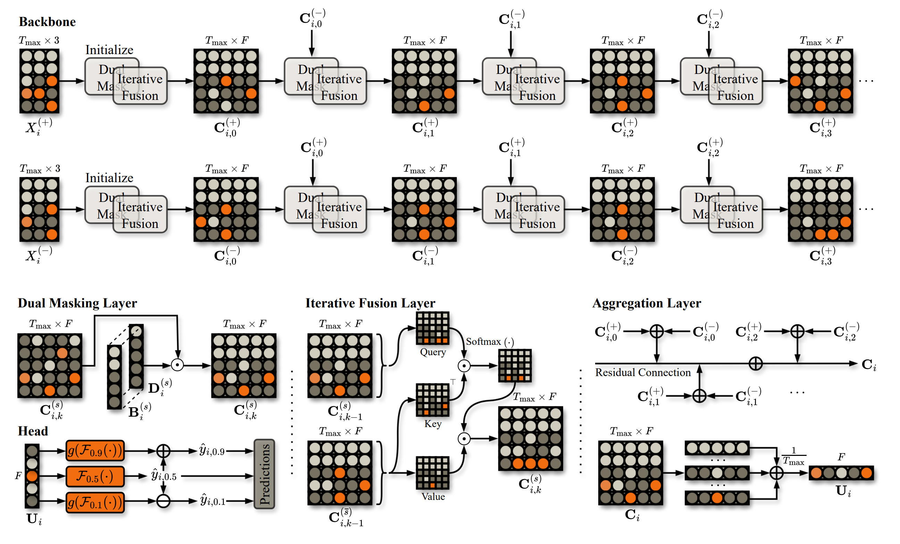

# OrderFusion
Encoding Orderbook for End-to-End Probabilistic Intraday Electricity Price Forecasting

🦊 Summary page: https://runyao-yu.github.io/OrderFusion/

🌋 Paper link: https://arxiv.org/pdf/2502.06830

---

## 🚀 Quick Start

We open-source all code for preprocessing, modeling, and analysis.  
The project directory is structured as follows:

    ├── Data/
        |- Country (e.g. Germany)
            |- Intraday Continuous
                |- Orders
                    |- Year (e.g. 2023)
                        |- Month (e.g. 01)
                        |- Month (e.g. 02)
                        |- Month (e.g. 03)
                        ...
                    ...
    ├── OrderFusion/
        ├── data.py/
        ├── model.py/
        ├── evaluation.py/
    ├── Figure/
    ├── Model/
    ├── Tutorial.ipynb
    ├── requirement.txt
    ├── README.md

The file `requirement.txt` specifies the required package versions.

To facilitate reproducibility and accessibility, we have streamlined the entire pipeline into just few simple steps:

### ✅ Step 1: prepare the folder structure
Place the purchased orderbook data into `Data` folder. Purchase source: https://webshop.eex-group.com/epex-spot-public-market-data (Several data types are available. For example, the “Continuous Anonymous Orders History” for Germany costs 325 EUR/month.)

### ✅ Step 2: pip install OrderFusion

Run `pip install OrderFusion` in your notebook.

### ✅ Step 3: run OrderFusion

Go through `Tutorial.ipynb` to understand the usage, e.g.:
- `OrderFusion.read_data()` to read data;
- `OrderFusion.optimize_model()` to train and optimize model;
- `OrderFusion.evaluate_model()` to produce various testing metrics;
- `OrderFusion.plot_forecasts()` to generate figure of forecasts.

